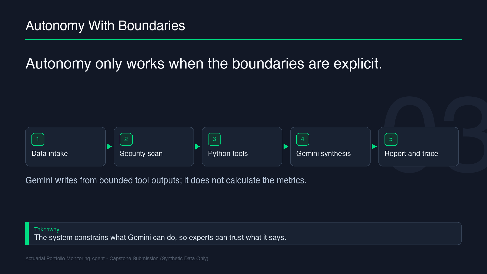

# Actuarial Portfolio Monitoring Agent

## Project Goal

Build a top-tier Kaggle Agents capstone project: at minimum, this repository should be as clear, runnable, evaluable, and submission-ready as the strongest examples used in the course.

The capstone is an agentic actuarial triage assistant. It reads synthetic insurance portfolio data, validates it, calculates deterministic monitoring metrics, detects material movements, investigates likely drivers, and drafts an actuary-ready review memo with traceable evidence.

## Root Pyramid

This repository is organized so the file tree itself tells you where to start:

```text
README.md             # Start here: goal, story, and branch map
AGENTS.md             # Always-on coding-agent instructions
project_build/        # Runnable app, tests, data, runtime skills, build config
spec_files/           # Canonical product, architecture, quality, and submission specs
submission/           # Kaggle writeup, checklist, video, and voice assets
assignment_details/   # Course notes, codelabs, references, archives, and maps
```

Root dot files and dot folders are local/tooling support. The important human branches are `project_build/`, `spec_files/`, `submission/`, and `assignment_details/`.

## Start Here

Read downward, then branch only when needed:

1. **Goal and demo path:** stay in this `README.md`.
2. **Runnable project:** open [`project_build/README.md`](project_build/README.md).
3. **Canonical project contract:** open [`spec_files/00_README_SPEC_INDEX.md`](spec_files/00_README_SPEC_INDEX.md).
4. **Submission package:** open [`submission/README.md`](submission/README.md).
5. **Course notes and references:** open [`assignment_details/README.md`](assignment_details/README.md) only when you need background evidence.

Generated outputs, old build evidence, voice/video assets, and source reference archives are intentionally lower in the tree so humans and LLMs do not have to read them first.

## What The Agent Does

The workflow is deliberately bounded:

```text
synthetic portfolio CSV
  -> validation and security scan
  -> deterministic metric calculations
  -> anomaly detection
  -> driver decomposition
  -> grounded LLM synthesis
  -> markdown report and JSON trace
```

The LLM writes narrative synthesis only from trusted tool outputs. Deterministic Python code calculates every numeric portfolio metric.



## Why This Is An Agent

A dashboard can display portfolio movement, but it does not perform the conditional first-pass investigation:

- Validate incoming data and reject unsafe paths or prompt-injection notes.
- Decide which driver slices to inspect after a material movement is detected.
- Turn calculated metrics and driver contributions into a conservative actuarial memo.
- Preserve an inspectable trace of decisions, tool calls, flags, and outputs.

## Run The Demo

All runnable project commands start from `project_build/`:

```bash
cd project_build
uv sync
```

Run the vertical slice without external LLM calls:

```bash
uv run python3 -m portfolio_agent.run --input "data/synthetic_portfolio_monthly.csv" --latest-month "2026-06" --force-offline
```

Optional: run online synthesis if Gemini credentials are configured:

```bash
uv run python3 -m portfolio_agent.run --input "data/synthetic_portfolio_monthly.csv" --latest-month "2026-06"
```

Outputs are written under `project_build/`:

- `outputs/reports/portfolio_review_<month>_<run_id>.md`
- `outputs/traces/run_trace_<run_id>.json`

## Verify Quality

From `project_build/`:

```bash
uv run pytest tests/unit tests/integration
```

Run local evals:

```bash
FORCE_OFFLINE=1 uv run python3 -m tests.eval.run_eval
```

The capstone quality story is documented in [`spec_files/30_quality/`](spec_files/30_quality/), including security, evaluation, observability, acceptance checks, and risks.

## Submission Story

The public submission should tell a simple story:

1. Insurance portfolio monitoring is repetitive but judgment-sensitive.
2. This agent automates the first-pass triage while keeping calculations deterministic.
3. Security controls contain file access, prompt injection, and external side effects.
4. Tests, evals, and traces prove the behavior is inspectable.
5. The final memo is advisory and intended for human actuarial review.

Use [`submission/README.md`](submission/README.md) for the Kaggle writeup, video assets, and final checklist.

## Synthetic Data Disclaimer

This repository uses synthetic data only. Generated reports are first-pass triage aids and are not formal actuarial opinions, binding underwriting decisions, or pricing authorizations.
