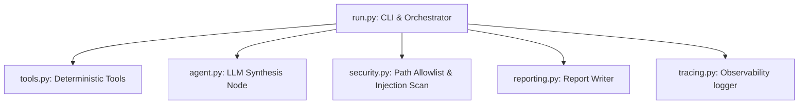

# Gate 1 — Plan-Only Build Plan
## Actuarial Portfolio Monitoring Agent

* **Spec Version**: 1.0.0
* **Build Plan Version**: 1.0.0
* **Date**: 2026-06-20

This document defines the implementation plan for the Actuarial Portfolio Monitoring Agent. It details module responsibilities, function contracts, dependencies, security controls, and the testing/verification strategy.

---

## 1. Package & Dependency Plan

We will use the local virtual environment managed by `uv`. The primary libraries to configure in `pyproject.toml` are:
* **`pandas`**: For data manipulation, metric calculations, and driver slicing.
* **`pydantic`**: For strictly validating data contracts (input schemas, output metrics, anomaly structures).
* **`google-genai`**: For LLM synthesis using the Gemini API.
* **`pdfplumber` & `pymupdf`**: For reference data ingestion (from the PDF skills).
* **`pytest`**: For local unit testing.
* **`pyyaml`**: For reading configuration parameters and expected golden values.

---

## 2. Module Responsibilities

The implementation will split codebase logic into separate files inside `portfolio_agent/`:

### 1. `portfolio_agent/schemas.py`
Defines the Pydantic data structures to validate metrics, anomalies, and driver analysis records:
* `MetricsRecord`: Container for calculated metrics for a given valuation month/segment.
* `AnomalyRecord`: Structure for a flagged anomaly (id, metric, current, prior, severity, explanation).
* `DriverResult`: Decomposition details (dimension, contributions, top drivers).
* `ReviewMemo`: Synthesized output structure from the LLM.

### 2. `portfolio_agent/security.py`
Implements the safety guardrails required by `specs/07_security_privacy_spec.md`:
* **Path Validation**: A function to assert that any requested input files reside strictly within `data/` or `examples/`.
* **Prompt Injection Scanner**: A function to scan the text columns (like `notes`) for keywords indicative of instruction overrides (e.g., "ignore previous instructions", "mark as low risk").

### 3. `portfolio_agent/tools.py`
Contains the deterministic calculations:
* `load_portfolio_data(file_path: str) -> pd.DataFrame`
* `validate_portfolio_data(df: pd.DataFrame) -> tuple[pd.DataFrame, list[str], list[str]]` (returns clean dataframe, errors, and warnings)
* `calculate_portfolio_metrics(df: pd.DataFrame, group_by: list[str]) -> list[MetricsRecord]`
* `detect_anomalies(metrics: list[MetricsRecord], latest_month: str) -> list[AnomalyRecord]`
* `investigate_anomaly_drivers(df: pd.DataFrame, anomaly: AnomalyRecord, dimensions: list[str]) -> list[DriverResult]`

### 4. `portfolio_agent/agent.py`
Coordinates the LLM step using `google-genai`:
* Connects to Gemini (e.g., `gemini-2.5-flash` or the latest stable release).
* Formulates a structured system prompt using instructions from `portfolio-monitoring/SKILL.md`.
* Passes the structured anomalies and driver lists.
* Requests a structured response matching the `ReviewMemo` schema using the SDK's `response_schema` option to prevent hallucinations.

### 5. `portfolio_agent/reporting.py`
Accepts the structured `ReviewMemo` and formats it into the markdown memo outlined in `22_output_report_template.md`, writing the file to `outputs/reports/`.

### 6. `portfolio_agent/tracing.py`
Records all execution events, input metadata, tool parameters, and decisions to a JSON file in `outputs/traces/`.

---

## 3. Tool Contracts

### `validate_portfolio_data`
* **Input**: `df` (Pandas DataFrame)
* **Output**:
  * `clean_df`: DataFrame (excluding bad rows)
  * `errors`: List of validation failures (missing columns, etc. - blocks run)
  * `warnings`: List of warnings (negative premiums, suspected injections)

### `calculate_portfolio_metrics`
* **Input**: `df` (DataFrame), `group_by` (List of column names)
* **Output**: List of `MetricsRecord` dicts.
* **Logic**:
  * Written Premium = Sum of `written_premium`
  * Earned Premium = Sum of `earned_premium`
  * Incurred Loss = Sum of `incurred_loss`
  * Loss Ratio = `Incurred Loss / Earned Premium` (if Earned Premium > 0)
  * Retention / Rate Change / Benchmark Adequacy = Weighted average by written premium.

### `detect_anomalies`
* **Input**: `metrics` (List of `MetricsRecord`), `latest_month` (String YYYY-MM)
* **Output**: List of `AnomalyRecord`.
* **Logic**: Compares `latest_month` metrics against previous month values. Applies:
  * Loss Ratio change >= +10 pts (Moderate), >= +20 pts (Severe).
  * Written Premium change >= 15% (Moderate), >= 30% (Severe).

---

## 4. First Vertical Slice (Gate 2 Target)

The first functional build must verify the core pipeline using the smallest end-to-end slice:
1. **Input**: A tiny CSV file with two rows:
   * Row 1: `2026-05`, `Public D&O`, Written Premium=100k, Earned=100k, Loss=50k (Loss Ratio = 50%)
   * Row 2: `2026-06`, `Public D&O`, Written Premium=100k, Earned=100k, Loss=85k (Loss Ratio = 85%)
2. **Tools**: Load data, calculate loss ratios, and flag the +35 pts spike as a Severe anomaly.
3. **Agent**: Pass the anomaly to the LLM and generate a simple 2-sentence markdown review note.
4. **Observability**: Verify that the trace logs the input size, calculated loss ratios, the anomaly, and output paths.

---

## 5. Verification & Testing Plan

### Automated Unit Tests
Write `pytest` scripts in `tests/`:
* `tests/test_tools.py`: Tests calculations against known inputs (e.g., zero earned premium, negative incurred loss).
* `tests/test_security.py`: Tests that path inputs outside `data/` are refused, and that note injections trigger `warnings` and human review escalation.

### Gate 3 Deterministic Golden Tests
Create a golden test suite under `tests/golden/`:
* `tests/golden/loss_ratio_spike.csv`
* `tests/golden/expected_loss_ratio_spike.yaml`
Confirm that the calculated metrics match the expected values within `0.0001` precision.
