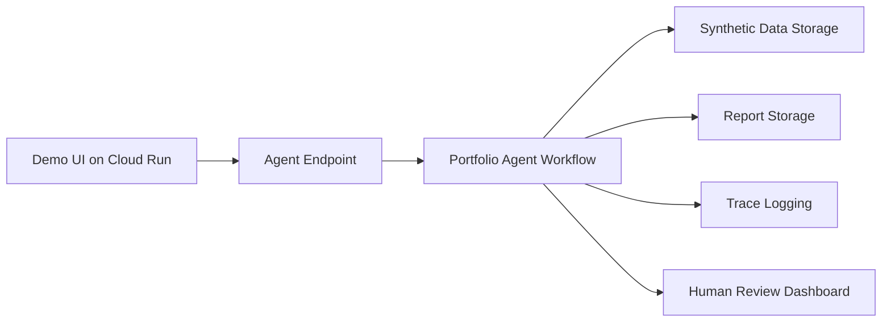

# Deployment Spec

## Deployment goal

The MVP should be easy for judges to run locally. Cloud deployment is optional and should not be required for the core demo unless time permits.

## Recommended deployment stages

### Stage 1: Local command-line demo

This is the primary target.

Expected command:

```bash
python -m portfolio_agent.run --input data/synthetic_portfolio_monthly.csv --latest-month 2026-06
```

Expected outputs:

```text
outputs/reports/portfolio_review_2026_06.md
outputs/traces/run_2026_06_001.json
```

### Stage 2: Local web/demo UI

Optional but useful for the video.

Possible approaches:
- Streamlit app.
- FastAPI endpoint with simple HTML page.
- Static HTML report viewer.

Minimum UI:
- Upload/select demo dataset.
- Click "Run Review".
- Show agent status, findings, human review flag, and report.

### Stage 3: Cloud deployment

Optional stretch goal.

Possible approaches:
- Cloud Run app for a simple dashboard.
- Agent Runtime for managed agent hosting.
- Pub/Sub-style event trigger if following the course codelab pattern.

## Local environment

Required:
- Python 3.11+
- `uv` or `pip`
- Git

Optional:
- Gemini API key or other model provider key
- Antigravity / Agents CLI for implementation workflow

## Environment variables

Use `.env.example`:

```bash
# Optional. Required only if using live LLM calls.
GEMINI_API_KEY=

# Set to false for consumer/developer API usage if applicable.
GOOGLE_GENAI_USE_ENTERPRISE=FALSE

# Runtime config
PORTFOLIO_AGENT_DATA_DIR=data
PORTFOLIO_AGENT_OUTPUT_DIR=outputs
```

Never commit `.env`.

## Directory structure

```text
portfolio-monitoring-agent/
├── README.md
├── pyproject.toml
├── .gitignore
├── .env.example
├── specs/
├── data/
│   ├── synthetic_portfolio_monthly.csv
│   └── eval/
├── portfolio_agent/
│   ├── run.py
│   ├── agent.py
│   ├── tools.py
│   ├── schemas.py
│   ├── security.py
│   ├── reporting.py
│   └── tracing.py
├── tests/
│   ├── test_tools.py
│   ├── test_security.py
│   └── eval/
├── outputs/
│   ├── reports/
│   └── traces/
└── .agents/
    ├── CONTEXT.md
    └── skills/
```

## Build commands

```bash
uv venv
source .venv/bin/activate
uv pip install -e .
python -m portfolio_agent.run --input data/synthetic_portfolio_monthly.csv --latest-month 2026-06
```

## Test commands

```bash
pytest
make eval
```

## Security scan commands

```bash
pre-commit run --all-files
semgrep --config .semgrep/rules.yaml .
```

## Reproducibility requirements

A judge should be able to:

1. Clone the repo.
2. Install dependencies.
3. Run a demo command.
4. See a generated report.
5. Run tests/evals.
6. Understand the architecture from README and specs.

## Deployment non-goals

The MVP does not require:
- Production database credentials.
- User authentication.
- Persistent cloud storage.
- Scheduled jobs.
- Email integration.

## Optional cloud architecture



## Submission note

If live deployment is not feasible, the public GitHub repository with detailed setup instructions satisfies the project-link requirement. The video should show the project running locally.
