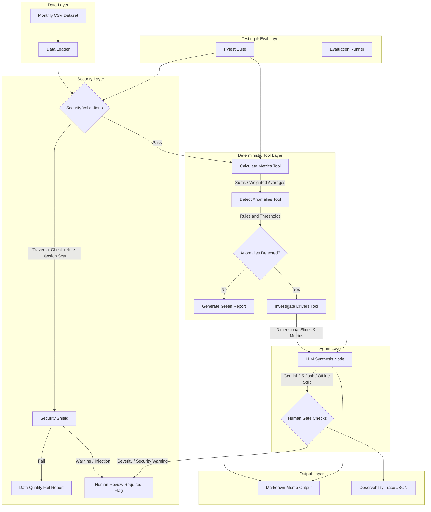

# System Architecture

This document provides a detailed overview of the system architecture for the **Actuarial Portfolio Monitoring Agent**.

---

## High-Level Architecture Diagram

The system consists of five distinct layers separating the data sources, calculations, reasoning agent, security guards, and final output deliverables:

---

## Bounded Architecture Layers

### 1. Data Layer
* **Data Input**: The system takes flat synthetic CSV aggregate files. Each row represents a portfolio aggregation cell (combination of segment, state, underwriter, coverage, etc.) for a specific valuation month.
* **Normalization**: The data loader parses column types, formats dates, and normalizes numeric metrics to facilitate vector operations using Pandas.

### 2. Security & Data Privacy Layer
* **Path Containment**: Path validation ensures files can only be read from or written to approved subdirectories (`data`, `examples`, `tests/golden`). Traversal attacks (e.g. `../../etc/passwd` or `../.env`) are intercepted and raised as errors.
* **Prompt Injection Scanners**: Text notes columns are treated as untrusted data. A notes scanner checks for instruction override strings (such as "ignore previous instructions") to prevent prompt manipulation. If found, a security warning is logged and a review gate is triggered.
* **Secrets Containment**: Evaluates generated text and log traces to ensure API keys and credentials are never output.

### 3. Deterministic Tool Layer
* **Metrics Tool**: Aggregates account counts, written premium, earned premium, incurred losses, and claim counts by month and segment. Calculates weighted averages for average retention, rate change, and benchmark adequacy using written premium as weights.
* **Anomaly Engine**: Compares the latest month's metrics to the previous month's metrics. Anomaly severity is computed using the following thresholds:
  * **Loss ratio increase**: Moderate >= 10 pts, Severe >= 20 pts.
  * **Written premium change**: Moderate >= 15%, Severe >= 30%.
  * **Claim count increase**: Moderate >= 25%, Severe >= 50%.
  * **Rate change deterioration**: Moderate >= 5 pts, Severe >= 10 pts.
  * **Benchmark adequacy decrease**: Moderate >= 0.05, Severe >= 0.10.
  * **Retention decrease**: Moderate >= 10%, Severe >= 25%.
* **Driver Slices**: Groups the segment data by coverage, state, policy year, and underwriter to compute category contribution margins:
  * Premium contribution: $\Delta WP_{slice} / WP_{total\_prior}$
  * Loss ratio contribution: $IL_{slice\_curr} / EP_{total\_curr} - IL_{slice\_prior} / EP_{total\_prior}$
  * Weighted average contribution: $W_{slice\_curr} M_{slice\_curr} / W_{total\_curr} - W_{slice\_prior} M_{slice\_prior} / W_{total\_prior}$

### 4. Agent Layer
* **Synthesis**: Translates raw metric arrays and driver lists into a structured review memo draft. Uses `google-genai` with a schema constraint (`ReviewMemo`) to enforce output structure.
* **Offline Resiliency**: Implements fallback stubs matching the expected metrics of the golden scenarios if the Gemini API is unavailable.
* **Human Gate Trigger**: Sets `requires_human_review = True` if:
  * Any severe (high) anomaly is detected.
  * Security scans detect prompt injections.
  * Data quality warnings are flagged (e.g., empty segments, negative values).
  * Confidence score falls below acceptable margins.

### 5. Output & Observability Layer
* **Report Compilation**: Renders a comprehensive markdown report citing exact metrics, driver tables, interpretations, caveats, follow-up questions, and trace references.
* **Trace log**: Writes a run JSON trace including timestamps, configurations, events (tool call start/stop/duration), flags, anomalies, and status.

---

## Validation & Verification Channels
* **Golden Tests**: Compares current metrics, severity flags, and driver slices against expected values defined in YAML files.
* **Evaluation Cases**: Evaluates non-deterministic LLM synthesis behavior, security containment, and report quality across 10 distinct evaluation cases.
