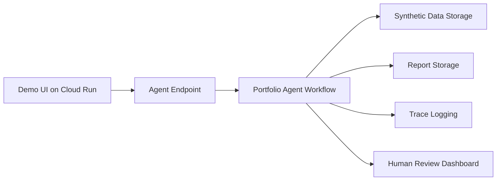

# Deployment Spec

## Deployment goal

The MVP should be easy for judges to run locally. Cloud deployment is optional and should not be required for the core demo unless time permits.

## Recommended deployment stages

### Stage 1: Local ADK and command-line demo

This is the primary target.

Expected command:

```bash
make install
make run-offline
agents-cli run "Review the approved loss-ratio-spike demo portfolio for 2026-06."
```

Expected outputs:

```text
outputs/reports/portfolio_review_2026_06.md
outputs/traces/run_2026_06_001.json
```

### Stage 2: Local FastAPI adapter

Optional but useful for the video.

Required endpoints:

- `GET /healthz`
- `GET /readyz`
- `POST /api/reviews`

The first version may be API-only. A dashboard or static report viewer remains optional.

### Stage 3: Cloud deployment

Optional stretch goal.

Possible approaches:
- Agent Runtime for interactive/session-based ADK hosting.
- Cloud Run for FastAPI and optional Pub/Sub/Eventarc ambient trigger endpoints.
- GKE only if operational requirements justify it.

Cloud deployment requires explicit approval and is not part of this specification-edit phase.

## Local environment

Required:
- Python 3.11+
- `uv`
- Git
- Agents CLI compatible with the generated manifest

Optional:
- Gemini API key or other model provider key
- Antigravity / Agents CLI for implementation workflow

## Environment variables

Use `.env.example`:

```bash
# Optional. Required only for an online local model call.
GOOGLE_API_KEY=

# False for AI Studio/local development; true for Vertex AI.
GOOGLE_GENAI_USE_VERTEXAI=false

GOOGLE_CLOUD_PROJECT=
GOOGLE_CLOUD_LOCATION=global

# Runtime config
PORTFOLIO_AGENT_DATA_DIR=data
PORTFOLIO_AGENT_OUTPUT_DIR=outputs
PORTFOLIO_AGENT_MODE=online
```

Never commit `.env`.

## Directory structure

```text
portfolio-monitoring-agent/
├── README.md
├── .agents-cli-spec.md
├── agents-cli-manifest.yaml
├── Makefile
├── Dockerfile
├── pyproject.toml
├── uv.lock
├── .gitignore
├── .env.example
├── specs/
├── data/
│   ├── synthetic_portfolio_monthly.csv
│   └── eval/
├── portfolio_agent/
│   ├── run.py
│   ├── agent.py
│   ├── adk_tools.py
│   ├── callbacks.py
│   ├── config.py
│   ├── fast_api_app.py
│   ├── tools.py
│   ├── schemas.py
│   ├── security.py
│   ├── reporting.py
│   └── tracing.py
├── skills/
│   └── portfolio_monitoring/
├── tests/
│   ├── unit/
│   ├── integration/
│   └── eval/
│       ├── datasets/
│       └── eval_config.yaml
├── outputs/
│   ├── reports/
│   └── traces/
└── artifacts/
    ├── traces/
    └── grade_results/
```

## Build commands

```bash
make install
make run-offline
make api
agents-cli run "Review the approved demo portfolio for 2026-06."
```

## Test commands

```bash
make test
make integration
agents-cli eval generate
agents-cli eval grade
```

## Security scan commands

```bash
pre-commit run --all-files
semgrep --config .semgrep/rules.yaml .
```

## Reproducibility requirements

A judge should be able to:

1. Clone the repo.
2. Install dependencies.
3. Run a demo command.
4. See a generated report.
5. Run tests/evals.
6. Understand the architecture from README and specs.
7. Run the core offline demo without credentials or network access.
8. Observe genuine ADK function-call/function-response events in an online trace.

## FastAPI contract

FastAPI is a transport adapter. It invokes the same application service as the CLI and must not duplicate actuarial calculations, tool policy, prompts, or report logic. Container startup must bind to `0.0.0.0` and the `PORT` environment variable, defaulting to `8080`.

## Ambient execution constraint

If scheduled or event-driven execution is added, use ADK trigger endpoints on Cloud Run or GKE. Do not specify Agent Runtime as the host for Pub/Sub/Eventarc trigger endpoints. Infrastructure remains optional.

## Deployment non-goals

The MVP does not require:
- Production database credentials.
- User authentication.
- Persistent cloud storage.
- Scheduled jobs.
- Email integration.

## Optional cloud architecture



## Submission note

If live deployment is not feasible, the public GitHub repository with detailed setup instructions satisfies the project-link requirement. The video should show the project running locally.
