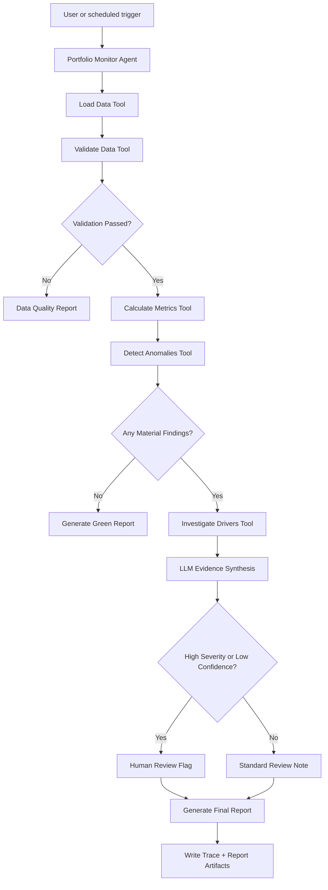

# Agent Architecture Spec

## Architecture goal

Design the agent as a bounded workflow. The LLM should reason, summarize, choose investigation paths, and explain findings. Deterministic tools should perform calculations, validation, and data slicing.

## Core principle

Do not let the LLM invent numbers. The LLM may interpret numbers returned by tools, but all portfolio metrics must be calculated by deterministic code.

## High-level workflow



## Main components

### 1. Portfolio Monitor Agent

Responsibilities:
- Understand the user's monitoring request.
- Select allowed tools.
- Interpret tool outputs.
- Decide when further investigation is needed.
- Generate the final review memo.
- Escalate high-risk findings to human review.

Forbidden:
- Inventing metrics not returned by tools.
- Reading files outside approved input directories.
- Writing outside approved output directories.
- Sending email or external messages without explicit human approval.
- Using real company data in the capstone demo.

### 2. Deterministic tool layer

The tool layer performs:
- File loading.
- Schema validation.
- Metric calculation.
- Anomaly detection.
- Driver decomposition.
- Report artifact writing.

### 3. Skill layer

The `portfolio-monitoring` skill teaches the agent the workflow for actuarial review:
- Begin with data quality.
- Separate fact from interpretation.
- Quantify movement.
- Identify concentration.
- Use conservative language.
- Flag uncertainty.

### 4. Evaluation layer

Evaluation checks:
- Routing correctness.
- Calculation consistency.
- Anomaly detection.
- Prompt-injection containment.
- Report usefulness.
- Human review escalation.

### 5. Observability layer

Every run should produce:
- `run_id`
- timestamp
- input dataset name
- tool calls
- tool inputs/outputs summary
- detected anomalies
- final severity
- human review flag
- output report path

## Agent workflow states

| State | Description | Exit condition |
|---|---|---|
| `receive_request` | User asks for monitoring run. | Request parsed. |
| `load_data` | Agent loads approved dataset. | Dataset loaded or error. |
| `validate_data` | Tool checks schema and data quality. | Pass, warning, or fail. |
| `calculate_metrics` | Deterministic calculations run. | Metrics table created. |
| `detect_anomalies` | Threshold and trend rules applied. | Findings list created. |
| `investigate_drivers` | Agent calls tools to slice drivers. | Driver evidence gathered. |
| `synthesize_findings` | Agent writes evidence-based summary. | Draft findings created. |
| `review_gate` | High severity/uncertainty check. | Human review flag set if needed. |
| `generate_report` | Report artifact written. | Report path returned. |
| `record_trace` | Trace artifact written. | Run complete. |

## Human-in-the-loop rules

Human review is required when:

- Loss ratio changes by more than configured severe threshold.
- Premium changes by more than configured severe threshold.
- Claim count increases sharply with sparse data.
- Data quality warnings affect the finding.
- Prompt injection or instruction override is detected in input text fields.
- The agent confidence score is below threshold.
- The agent recommends any business action beyond investigation.

## Required workflow implementation

Version 0.2 selects Google ADK rather than leaving framework choice open. `portfolio_agent/agent.py` must export a discoverable `root_agent`; the ADK application name must match the `portfolio_agent` directory.

The implementation may use an ADK `Agent` with function tools or an ADK 2.0 `Workflow`. The preferred first migration is one bounded root agent with deterministic tools and callbacks. A graph workflow is appropriate only when explicit conditional edges improve correctness.

Logical workflow nodes:

1. `load_data_node`
2. `validate_data_node`
3. `metrics_node`
4. `anomaly_detection_node`
5. `driver_investigation_node`
6. `synthesis_agent_node`
7. `human_review_gate_node`
8. `report_writer_node`

The deterministic orchestration path remains as the offline reproducibility adapter and regression reference. It must be clearly distinguished from online ADK model-directed tool use in demos, traces, and documentation.

### ADK responsibilities

- `root_agent`: understand the review request, call only allowed tools, select useful investigation dimensions, and synthesize grounded findings.
- `App`: bind `root_agent`, session state, callbacks/plugins, and optional resumability.
- `ToolContext`: hold opaque dataset references and structured intermediate results without placing raw data into prompts.
- callbacks: initialize state, enforce tool and path policy, sanitize model context, validate outputs, and record timing/status.
- runner/session service: provide consistent CLI, FastAPI, and evaluation execution.

Do not attach `output_schema` to a tool-calling agent if doing so disables tool calling in the installed ADK version. Use a separate structured synthesis agent/node or validate the final result after the tool-calling phase.

### Agent selection boundary

Deterministic code must always perform loading, validation, calculations, threshold detection, and artifact path enforcement. The agent may choose which allowed driver dimensions to investigate after receiving an anomaly record. A clean portfolio must not call driver investigation tools.

## Data flow

Input:
- Synthetic CSV file.
- Optional run configuration YAML.

Intermediate outputs:
- Validated dataframe.
- Metrics table.
- Anomaly list.
- Driver contribution tables.
- LLM synthesis text.

Final outputs:
- Markdown report.
- Trace JSON.
- Evaluation scorecard.
- Structured `PortfolioReviewResult` shared by CLI and FastAPI.

## Delivery adapters

`portfolio_agent/run.py` and `portfolio_agent/fast_api_app.py` invoke the same application service. Neither adapter may contain actuarial calculations, threshold logic, prompt policy, or report-validation rules.

Offline mode bypasses model construction entirely and uses deterministic orchestration plus template synthesis. It is a reproducibility path, not an agent-quality evaluation result.

## Error handling

| Error | Expected behavior |
|---|---|
| Missing file | Return clear error; do not run analysis. |
| Missing required column | Blocking validation failure. |
| Null key fields | Warning or fail depending on severity. |
| Negative premium/loss | Data quality warning; exclude or flag rows. |
| Unknown segment | Include but flag as unmapped. |
| No anomalies found | Generate green report. |
| Tool exception | Capture in trace and produce safe error response. |
| Prompt injection detected | Escalate to human review and bypass LLM for injected content. |

## Output contract

The agent's final answer should include:

- Run status.
- Top findings.
- Severity.
- Data quality status.
- Human review flag.
- Report path.
- Trace path.

Example:

```text
Run complete.
Severity: High
Human review required: Yes
Top finding: Public D&O loss ratio increased from 52% to 71%, driven primarily by two large claims in the 2025 policy year.
Report: outputs/reports/portfolio_review_2026_06.md
Trace: outputs/traces/run_2026_06_001.json
```
